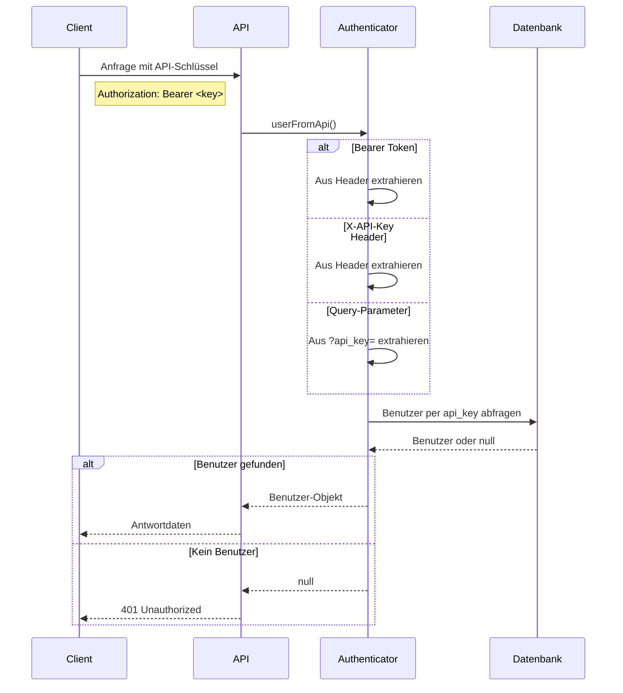
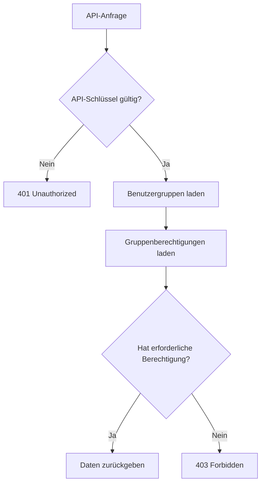

# API-Authentifizierung

Die REST-API des Engelsystems verwendet API-Schlüssel zur Authentifizierung. Jeder Benutzer hat einen eindeutigen API-Schlüssel, der seine Anfragen identifiziert und autorisiert.

## Deinen API-Schlüssel finden

1. Melde dich beim Engelsystem an
2. Gehe zu deinen Profileinstellungen
3. Finde deinen API-Schlüssel im Einstellungsbereich
4. Kopiere den Schlüssel - es ist eine lange zufällige Zeichenkette

Halte deinen API-Schlüssel geheim. Jeder mit deinem Schlüssel kann die API in deinem Namen nutzen.

## Authentifizierungsmethoden

Die API akzeptiert deinen Schlüssel auf drei Arten. Verwende die Methode, die zu deinem Client passt.

### Bearer Token (Empfohlen)

Sende den Schlüssel im `Authorization`-Header als Bearer Token:

```
Authorization: Bearer dein-api-schlüssel-hier
```

Beispiel mit curl:
```bash
curl -H "Authorization: Bearer abc123xyz..." \
     https://engelsystem.example.com/api/v0-beta/angeltypes
```

### X-API-Key Header

Sende den Schlüssel in einem benutzerdefinierten Header:

```
x-api-key: dein-api-schlüssel-hier
```

Beispiel mit curl:
```bash
curl -H "x-api-key: abc123xyz..." \
     https://engelsystem.example.com/api/v0-beta/angeltypes
```

### Query-Parameter

Hänge den Schlüssel als URL-Parameter an:

```
?api_key=dein-api-schlüssel-hier
```

Beispiel:
```bash
curl "https://engelsystem.example.com/api/v0-beta/angeltypes?api_key=abc123xyz..."
```

{}
Query-Parameter können von Proxies und Webservern geloggt werden. Verwende wenn möglich Header-basierte Authentifizierung.
{}

## Authentifizierungsablauf



## Antwort-Codes

| Code | Bedeutung | Ursache |
|------|-----------|---------|
| 200 | Erfolg | Anfrage abgeschlossen |
| 401 | Unauthorized | Fehlender oder ungültiger API-Schlüssel |
| 403 | Forbidden | Gültiger Schlüssel aber unzureichende Berechtigungen |
| 404 | Not Found | Ressource existiert nicht |

### Unauthorized-Antwort

Wenn die Authentifizierung fehlschlägt:

```json
{
  "errors": [
    {
      "status": "401",
      "title": "Unauthorized",
      "detail": "API key required"
    }
  ]
}
```

### Forbidden-Antwort

Wenn die erforderliche Berechtigung fehlt:

```json
{
  "errors": [
    {
      "status": "403",
      "title": "Forbidden",
      "detail": "Insufficient permissions"
    }
  ]
}
```

## Berechtigungen

Dein API-Zugang ist durch deine Benutzer-Gruppenmitgliedschaften und Berechtigungen eingeschränkt. Die gleichen Berechtigungen, die in der Weboberfläche gelten, gelten auch für die API.



Zum Beispiel:
- Jeder authentifizierte Benutzer kann seine eigenen Schichten sehen
- Nur Benutzer mit `admin_user`-Berechtigung können Details anderer Benutzer sehen
- Nur Benutzer mit `shifts.edit`-Berechtigung können Schichten ändern

## Sicherheits-Best-Practices

**Schlüssel regelmäßig rotieren.** Generiere einen neuen API-Schlüssel in deinen Profileinstellungen, wenn du einen Kompromittierung vermutest.

**HTTPS verwenden.** Verbinde dich immer über HTTPS mit dem Engelsystem. Die API sollte Nicht-HTTPS-Verbindungen ablehnen.

**Schlüssel nicht hardcoden.** Verwende Umgebungsvariablen oder Secret-Management:

```bash
# Gut - Schlüssel in Umgebungsvariable
curl -H "Authorization: Bearer $ENGELSYSTEM_API_KEY" ...

# Schlecht - Schlüssel im Code
curl -H "Authorization: Bearer abc123..." ...
```

**Schlüssel-Scope einschränken.** Wenn du eine Anwendung baust, erstelle ein dediziertes Benutzerkonto mit nur den benötigten Berechtigungen.

## Häufige Integrationsmuster

### Python

```python
import requests

API_KEY = os.environ['ENGELSYSTEM_API_KEY']
BASE_URL = 'https://engelsystem.example.com/api/v0-beta'

headers = {'Authorization': f'Bearer {API_KEY}'}

response = requests.get(f'{BASE_URL}/angeltypes', headers=headers)
angel_types = response.json()['data']
```

### JavaScript

```javascript
const API_KEY = process.env.ENGELSYSTEM_API_KEY;
const BASE_URL = 'https://engelsystem.example.com/api/v0-beta';

const response = await fetch(`${BASE_URL}/angeltypes`, {
  headers: {
    'Authorization': `Bearer ${API_KEY}`
  }
});
const { data: angelTypes } = await response.json();
```

### curl

```bash
#!/bin/bash
API_KEY="${ENGELSYSTEM_API_KEY}"
BASE_URL="https://engelsystem.example.com/api/v0-beta"

curl -s -H "Authorization: Bearer ${API_KEY}" \
     "${BASE_URL}/angeltypes" | jq '.data'
```

## API-Schlüssel neu generieren

Wenn dein Schlüssel kompromittiert wurde:

1. Melde dich beim Engelsystem an
2. Gehe zu den Profileinstellungen
3. Klicke auf "API-Schlüssel neu generieren"
4. Aktualisiere deine Anwendungen mit dem neuen Schlüssel

Der alte Schlüssel wird sofort ungültig.

