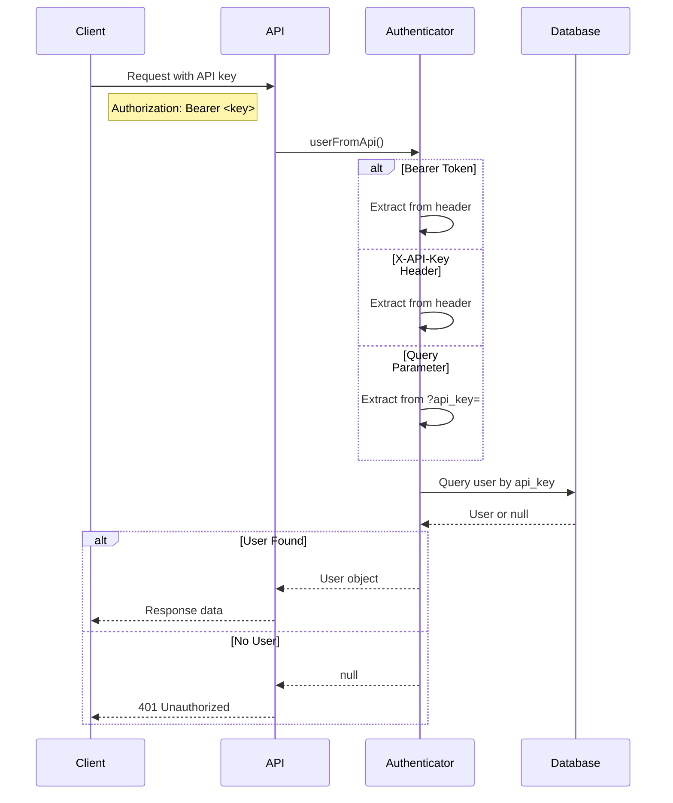
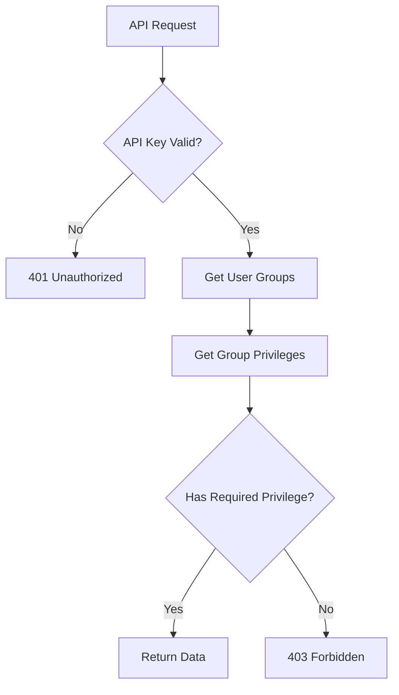

# API Authentication

Engelsystem's REST API uses API key authentication. Each user has a unique API key that identifies and authorizes their requests.

## Getting Your API Key

1. Log in to Engelsystem
2. Go to your profile settings
3. Find your API key in the settings section
4. Copy the key - it's a long random string

Keep your API key secret. Anyone with your key can access the API as you.

## Authentication Methods

The API accepts your key in three ways. Use whichever fits your client best.

### Bearer Token (Recommended)

Send the key in the `Authorization` header as a Bearer token:

```
Authorization: Bearer your-api-key-here
```

Example with curl:
```bash
curl -H "Authorization: Bearer abc123xyz..." \
     https://engelsystem.example.com/api/v0-beta/angeltypes
```

### X-API-Key Header

Send the key in a custom header:

```
x-api-key: your-api-key-here
```

Example with curl:
```bash
curl -H "x-api-key: abc123xyz..." \
     https://engelsystem.example.com/api/v0-beta/angeltypes
```

### Query Parameter

Append the key as a URL parameter:

```
?api_key=your-api-key-here
```

Example:
```bash
curl "https://engelsystem.example.com/api/v0-beta/angeltypes?api_key=abc123xyz..."
```

{}
Query parameters may be logged by proxies and web servers. Use header-based authentication when possible.
{}

## Authentication Flow



## Response Codes

| Code | Meaning | Cause |
|------|---------|-------|
| 200 | Success | Request completed |
| 401 | Unauthorized | Missing or invalid API key |
| 403 | Forbidden | Valid key but insufficient permissions |
| 404 | Not Found | Resource doesn't exist |

### Unauthorized Response

When authentication fails:

```json
{
  "errors": [
    {
      "status": "401",
      "title": "Unauthorized",
      "detail": "API key required"
    }
  ]
}
```

### Forbidden Response

When you lack the required privilege:

```json
{
  "errors": [
    {
      "status": "403",
      "title": "Forbidden",
      "detail": "Insufficient permissions"
    }
  ]
}
```

## Permissions

Your API access is limited by your user's group memberships and privileges. The same permissions that apply in the web interface apply to the API.



For example:
- Any authenticated user can view their own shifts
- Only users with `admin_user` privilege can view other users' details
- Only users with `shifts.edit` privilege can modify shifts

## Security Best Practices

**Rotate keys periodically.** Generate a new API key from your profile settings if you suspect compromise.

**Use HTTPS.** Always connect to Engelsystem over HTTPS. The API should refuse non-HTTPS connections.

**Don't hardcode keys.** Use environment variables or secret management:

```bash
# Good - key in environment
curl -H "Authorization: Bearer $ENGELSYSTEM_API_KEY" ...

# Bad - key in code
curl -H "Authorization: Bearer abc123..." ...
```

**Limit key scope.** If you're building an application, create a dedicated user account with only the permissions needed.

## Common Integration Patterns

### Python

```python
import requests

API_KEY = os.environ['ENGELSYSTEM_API_KEY']
BASE_URL = 'https://engelsystem.example.com/api/v0-beta'

headers = {'Authorization': f'Bearer {API_KEY}'}

response = requests.get(f'{BASE_URL}/angeltypes', headers=headers)
angel_types = response.json()['data']
```

### JavaScript

```javascript
const API_KEY = process.env.ENGELSYSTEM_API_KEY;
const BASE_URL = 'https://engelsystem.example.com/api/v0-beta';

const response = await fetch(`${BASE_URL}/angeltypes`, {
  headers: {
    'Authorization': `Bearer ${API_KEY}`
  }
});
const { data: angelTypes } = await response.json();
```

### curl

```bash
#!/bin/bash
API_KEY="${ENGELSYSTEM_API_KEY}"
BASE_URL="https://engelsystem.example.com/api/v0-beta"

curl -s -H "Authorization: Bearer ${API_KEY}" \
     "${BASE_URL}/angeltypes" | jq '.data'
```

## Regenerating Your API Key

If your key is compromised:

1. Log in to Engelsystem
2. Go to profile settings
3. Click "Regenerate API Key"
4. Update your applications with the new key

The old key becomes invalid immediately.

