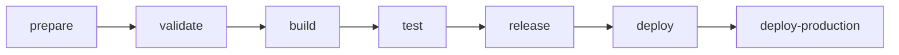
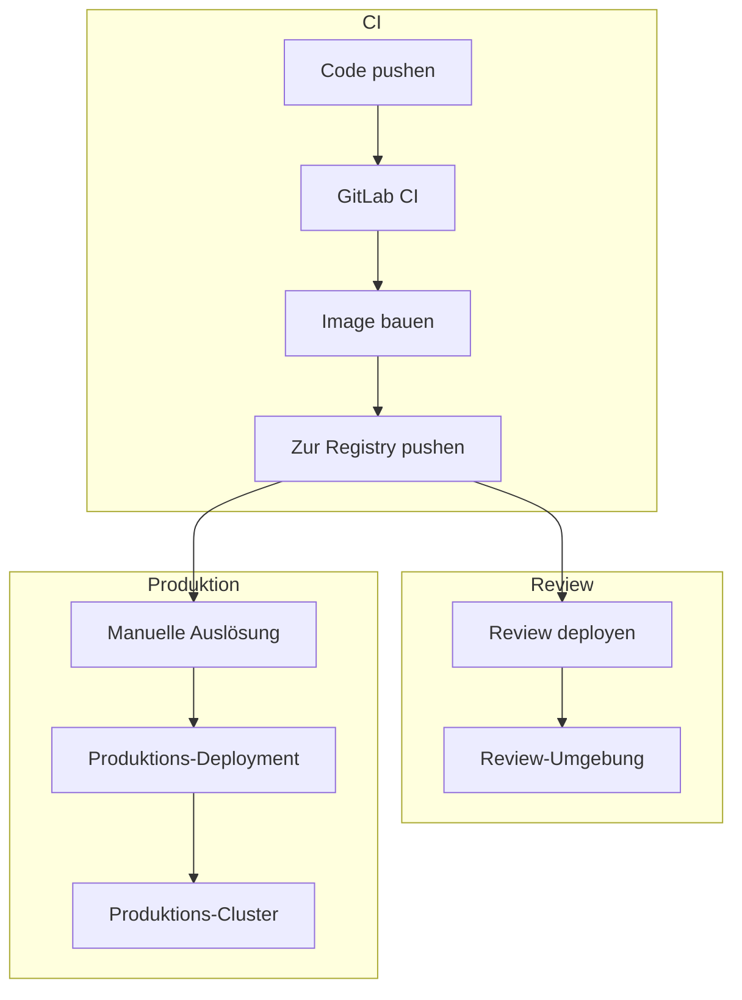

Das Engelsystem verwendet GitLab CI/CD für kontinuierliche Integration und Deployment. Die Pipeline automatisiert Tests, Builds und Deployments.

## Pipeline-Übersicht



Die Pipeline durchläuft sieben Stufen, wobei jede auf den Artefakten der vorherigen aufbaut.

## Stufen

### 1. Prepare

Installiert alle Abhängigkeiten:

| Job | Zweck | Ausgabe |
|-----|-------|---------|
| `composer-install` | PHP-Abhängigkeiten installieren | `vendor/`-Verzeichnis |
| `yarn-install` | Node.js-Abhängigkeiten installieren | `node_modules/`-Verzeichnis |

### 2. Validate

Code-Qualität und Sicherheitsprüfungen:

| Job | Tool | Zweck |
|-----|------|-------|
| `composer-validate` | Composer | Validiert composer.json-Struktur |
| `composer-audit` | Composer | Sicherheitsaudit der PHP-Abhängigkeiten |
| `yarn-validate` | Yarn | Validiert package.json-Struktur |
| `yarn-audit` | Yarn | Sicherheitsaudit der JS-Abhängigkeiten |
| `phpcs` | PHP_CodeSniffer | PHP-Code-Stil-Durchsetzung |
| `phpstan` | PHPStan | Statische Typanalyse |
| `eslint` | ESLint | JavaScript/TypeScript-Linting |

### 3. Build

Erstellt produktionsreife Artefakte:

**yarn-build**
- Kompiliert TypeScript und SCSS
- Bündelt JavaScript mit Webpack
- Eingabe: `resources/assets/`
- Ausgabe: `public/assets/`

**kaniko-build** (nur geschützte Branches)
- Baut Docker-Image mit Kaniko
- Pusht zur Container-Registry
- Kein Docker-Daemon erforderlich

### 4. Test

Führt die Test-Suite aus:

```yaml
phpunit:
  stage: test
  services:
    - mariadb:10.7
  variables:
    MYSQL_DATABASE: engelsystem
    MYSQL_USER: engelsystem
    MYSQL_PASSWORD: engelsystem
    MYSQL_ROOT_PASSWORD: engelsystem
  script:
    - php -d pcov.enabled=1 vendor/bin/phpunit \
        --coverage-text \
        --coverage-cobertura=coverage.xml \
        --log-junit=report.xml
  coverage: '/^\s*Lines:\s*\d+.\d+\%/'
  artifacts:
    reports:
      coverage_report:
        coverage_format: cobertura
        path: coverage.xml
      junit: report.xml
```

Der Test-Job:
- Startet einen MariaDB-Service-Container
- Führt PHPUnit mit Coverage-Erfassung aus
- Produziert Coverage- und JUnit-Berichte
- Zeigt Coverage-Prozentsatz in Merge Requests

### 5. Release

Taggt Docker-Images für versionierte Releases:

- `tag-release` - Erstellt Versions-Tags auf dem Container-Image
- Läuft nur bei Git-Tags (z.B. `v3.5.0`)

### 6. Deploy Review

Erstellt temporäre Review-Umgebungen für Merge Requests:

- Automatisch bei Merge Requests ausgelöst
- Jeder MR erhält seine eigene isolierte Umgebung
- URL-Muster: `https://{branch}.review.engelsystem.example.com`
- Umgebung wird gelöscht wenn MR gemergt oder geschlossen wird

### 7. Deploy Production

Produktions-Deployment mit manueller Freigabe:

- Erfordert manuelle Auslösung (Klick zum Deployen)
- Nur auf geschützten Branches verfügbar
- Deployed zum Kubernetes-Cluster
- Aktualisiert Produktionsumgebung

## Variablen und Secrets

Konfiguriere diese in den GitLab CI/CD-Einstellungen:

| Variable | Beschreibung | Geschützt |
|----------|--------------|-----------|
| `CI_REGISTRY_IMAGE` | Container-Registry-URL | Nein |
| `KUBE_CONFIG` | Kubernetes-Konfiguration (base64) | Ja |
| `KUBE_NAMESPACE` | Ziel-Kubernetes-Namespace | Nein |

Geschützte Variablen sind nur auf geschützten Branches verfügbar.

## Lokales Testen

Führe die gleichen Prüfungen lokal aus bevor du pushst:

```bash
# Alle Nix-Checks ausführen
nix flake check

# Einzelne Checks
nix run .#check-phpcs     # Code-Stil
nix run .#check-phpstan   # Statische Analyse
nix run .#check-phpunit   # Test-Suite
```

Oder mit traditionellen Tools:

```bash
# PHP-Code-Stil
vendor/bin/phpcs

# Statische Analyse
vendor/bin/phpstan analyze

# Tests
vendor/bin/phpunit
```

## Docker-Image

Die CI-Pipeline baut ein Produktions-Docker-Image:

**Enthalten:**
- PHP 8.2 mit erforderlichen Erweiterungen
- Kompilierte Frontend-Assets
- Produktions-PHP-Abhängigkeiten
- Webserver-Konfiguration

**Nicht enthalten:**
- Entwicklungsabhängigkeiten
- Testdateien
- Git-Historie
- Quell-Asset-Dateien

## Deployment-Architektur



## Kubernetes-Ressourcen

Das Deployment erstellt diese Kubernetes-Ressourcen:

| Ressource | Zweck |
|-----------|-------|
| Deployment | Anwendungs-Pods mit Replikat-Verwaltung |
| Service | Interne Cluster-Vernetzung |
| Ingress | Externer HTTPS-Zugang |
| ConfigMap | Anwendungskonfiguration |
| Secret | Datenbank-Credentials und andere Secrets |
| PersistentVolumeClaim | Speicher für Logs (falls benötigt) |

## Rollback

Um zu einem vorherigen Deployment zurückzukehren:

```bash
# Zur vorherigen Revision zurückrollen
kubectl rollout undo deployment/engelsystem

# Zu einer bestimmten Revision zurückrollen
kubectl rollout undo deployment/engelsystem --to-revision=2

# Oder ein bestimmtes Image-Tag neu deployen
kubectl set image deployment/engelsystem \
    engelsystem=registry/engelsystem:v3.4.0
```

## Fehlerbehebung

**Pipeline schlägt bei Validate-Stufe fehl**

Führe den spezifischen Check lokal aus um detaillierte Fehler zu sehen:
```bash
nix run .#check-phpcs
```

**Tests schlagen mit Datenbankfehlern fehl**

Stelle sicher, dass dein lokaler Test die gleiche MariaDB-Version (10.7) und Konfiguration wie CI verwendet.

**Docker-Build schlägt fehl**

Prüfe, dass alle erforderlichen Dateien in den `.dockerignore`-Ausschlüssen enthalten sind und die Dockerfile-Syntax gültig ist.

**Deployment läuft in Timeout**

Überprüfe, ob die Kubernetes-Credentials gültig sind und der Namespace existiert. Prüfe Pod-Events auf Startfehler.

