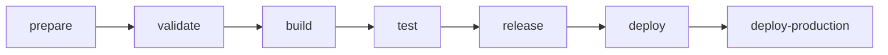
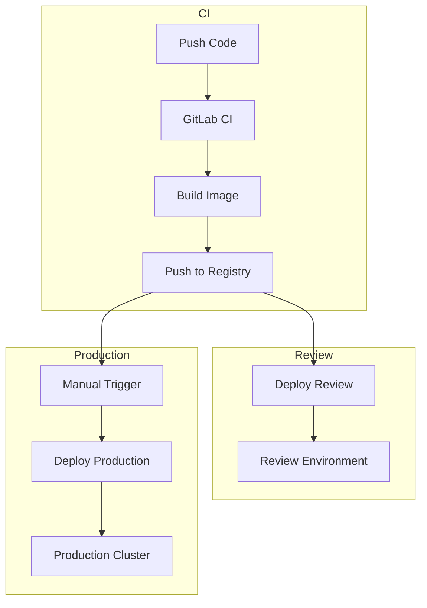

Engelsystem uses GitLab CI/CD for continuous integration and deployment. The pipeline automates testing, building, and deployment.

## Pipeline Overview



The pipeline runs through seven stages, each building on the previous one's artifacts.

## Stages

### 1. Prepare

Installs all dependencies:

| Job | Purpose | Output |
|-----|---------|--------|
| `composer-install` | Install PHP dependencies | `vendor/` directory |
| `yarn-install` | Install Node.js dependencies | `node_modules/` directory |

### 2. Validate

Code quality and security checks:

| Job | Tool | Purpose |
|-----|------|---------|
| `composer-validate` | Composer | Validate composer.json structure |
| `composer-audit` | Composer | Security audit of PHP dependencies |
| `yarn-validate` | Yarn | Validate package.json structure |
| `yarn-audit` | Yarn | Security audit of JS dependencies |
| `phpcs` | PHP_CodeSniffer | PHP code style enforcement |
| `phpstan` | PHPStan | Static type analysis |
| `eslint` | ESLint | JavaScript/TypeScript linting |

### 3. Build

Creates production-ready artifacts:

**yarn-build**
- Compiles TypeScript and SCSS
- Bundles JavaScript with Webpack
- Input: `resources/assets/`
- Output: `public/assets/`

**kaniko-build** (protected branches only)
- Builds Docker image using Kaniko
- Pushes to container registry
- No Docker daemon required

### 4. Test

Runs the test suite:

```yaml
phpunit:
  stage: test
  services:
    - mariadb:10.7
  variables:
    MYSQL_DATABASE: engelsystem
    MYSQL_USER: engelsystem
    MYSQL_PASSWORD: engelsystem
    MYSQL_ROOT_PASSWORD: engelsystem
  script:
    - php -d pcov.enabled=1 vendor/bin/phpunit \
        --coverage-text \
        --coverage-cobertura=coverage.xml \
        --log-junit=report.xml
  coverage: '/^\s*Lines:\s*\d+.\d+\%/'
  artifacts:
    reports:
      coverage_report:
        coverage_format: cobertura
        path: coverage.xml
      junit: report.xml
```

The test job:
- Spins up a MariaDB service container
- Runs PHPUnit with coverage collection
- Produces coverage and JUnit reports
- Displays coverage percentage in merge requests

### 5. Release

Tags Docker images for versioned releases:

- `tag-release` - Creates version tags on the container image
- Only runs on git tags (e.g., `v3.5.0`)

### 6. Deploy Review

Creates temporary review environments for merge requests:

- Automatically triggered on merge requests
- Each MR gets its own isolated environment
- URL pattern: `https://{branch}.review.engelsystem.example.com`
- Environment deleted when MR is merged or closed

### 7. Deploy Production

Production deployment with manual approval:

- Requires manual trigger (click to deploy)
- Only available on protected branches
- Deploys to Kubernetes cluster
- Updates production environment

## Variables and Secrets

Configure these in GitLab CI/CD settings:

| Variable | Description | Protected |
|----------|-------------|-----------|
| `CI_REGISTRY_IMAGE` | Container registry URL | No |
| `KUBE_CONFIG` | Kubernetes configuration (base64) | Yes |
| `KUBE_NAMESPACE` | Target Kubernetes namespace | No |

Protected variables are only available on protected branches.

## Local Testing

Run the same checks locally before pushing:

```bash
# Run all Nix checks
nix flake check

# Individual checks
nix run .#check-phpcs     # Code style
nix run .#check-phpstan   # Static analysis
nix run .#check-phpunit   # Test suite
```

Or with traditional tools:

```bash
# PHP code style
vendor/bin/phpcs

# Static analysis
vendor/bin/phpstan analyze

# Tests
vendor/bin/phpunit
```

## Docker Image

The CI pipeline builds a production Docker image:

**Included:**
- PHP 8.2 with required extensions
- Compiled frontend assets
- Production PHP dependencies
- Web server configuration

**Not included:**
- Development dependencies
- Test files
- Git history
- Source asset files

## Deployment Architecture



## Kubernetes Resources

Deployment creates these Kubernetes resources:

| Resource | Purpose |
|----------|---------|
| Deployment | Application pods with replica management |
| Service | Internal cluster networking |
| Ingress | External HTTPS access |
| ConfigMap | Application configuration |
| Secret | Database credentials and other secrets |
| PersistentVolumeClaim | Storage for logs (if needed) |

## Rollback

To revert to a previous deployment:

```bash
# Roll back to previous revision
kubectl rollout undo deployment/engelsystem

# Roll back to specific revision
kubectl rollout undo deployment/engelsystem --to-revision=2

# Or redeploy a specific image tag
kubectl set image deployment/engelsystem \
    engelsystem=registry/engelsystem:v3.4.0
```

## Troubleshooting

**Pipeline fails at validate stage**

Run the specific check locally to see detailed errors:
```bash
nix run .#check-phpcs
```

**Tests fail with database errors**

Ensure your local test uses the same MariaDB version (10.7) and configuration as CI.

**Docker build fails**

Check that all required files are included in `.dockerignore` exclusions and that the Dockerfile syntax is valid.

**Deployment times out**

Verify Kubernetes credentials are valid and the namespace exists. Check pod events for startup failures.

