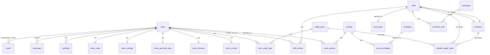

# Datenbank

Das Engelsystem verwendet MySQL/MariaDB mit Eloquent ORM für den Datenbankzugriff. Diese Seite dokumentiert das Schema, die Models und das Migrationssystem.

## Schema-Überblick

Die Datenbank enthält über 40 Tabellen, die um zentrale Entitäten organisiert sind. Die zentrale Entität ist die `users`-Tabelle mit verknüpften Tabellen für Profildaten, Berechtigungen und Aktivitäten.



## Wichtige Tabellen

### Benutzer-Tabellen

| Tabelle | Zweck |
|---------|-------|
| `users` | Benutzerkonten (Name, E-Mail, Passwort-Hash, API-Schlüssel) |
| `users_contact` | Kontaktinformationen (DECT-Nummer, Mobiltelefon, E-Mail-Sichtbarkeit) |
| `users_personal_data` | Persönliche Daten (Vor-/Nachname, Pronomen, T-Shirt-Größe, geplante Tage) |
| `users_state` | Benutzer-Status (angekommen, aktiv, T-Shirt erhalten, force_active) |
| `users_settings` | Einstellungen (Sprache, Theme, E-Mail-Benachrichtigungen) |
| `users_licenses` | Führerscheine (PKW, LKW, Gabelstapler) |

### Berechtigungs-Tabellen

| Tabelle | Zweck |
|---------|-------|
| `groups` | Berechtigungsgruppen (Angel, Supporter, Bureaucrat, etc.) |
| `privileges` | Einzelberechtigungen (user.edit, shifts.edit, etc.) |
| `group_privileges` | Verknüpft Gruppen mit Berechtigungen |
| `users_groups` | Verknüpft Benutzer mit Gruppen |

### Schicht-Tabellen

| Tabelle | Zweck |
|---------|-------|
| `shifts` | Geplante Schichten (Titel, Start-/Endzeit, Ort) |
| `shift_types` | Kategorien von Schichten (mit Beschreibungen) |
| `shift_entries` | Schichtanmeldungen (mit Freeload-Markierungen) |
| `needed_angel_types` | Benötigte Engel pro Schicht/Ort/Typ |

### Engeltyp-Tabellen

| Tabelle | Zweck |
|---------|-------|
| `angel_types` | Arten von Freiwilligenarbeit (mit Anforderungen) |
| `user_angel_type` | Benutzerqualifikationen und Supporter-Status |

### Ort-Tabellen

| Tabelle | Zweck |
|---------|-------|
| `locations` | Physische Orte (Name, Beschreibung, Karten-URL) |

### Fahrplan-Import-Tabellen

| Tabelle | Zweck |
|---------|-------|
| `schedules` | Externe Fahrplan-Quellen (Frab/Pretalx-URLs) |
| `schedule_shift` | Verknüpft importierte Schichten mit Quell-Fahrplänen |

### Kommunikations-Tabellen

| Tabelle | Zweck |
|---------|-------|
| `news` | Ankündigungen und News-Beiträge |
| `news_comments` | Kommentare zu News-Einträgen |
| `messages` | Interne Benutzer-zu-Benutzer-Nachrichten |
| `questions` | Frage-Antwort-System |

### Weitere Tabellen

| Tabelle | Zweck |
|---------|-------|
| `worklogs` | Manuelle Arbeitsstunden-Einträge |
| `log_entries` | Audit-Log für Admin-Aktionen |
| `sessions` | Benutzer-Session-Speicher |
| `oauth` | OAuth-Provider-Verknüpfungen für externe Authentifizierung |
| `faq` | FAQ-Einträge |

## Eloquent Models

### Basis-Model

Alle Models erweitern `BaseModel`, das gemeinsame Konfiguration bereitstellt:

```php
namespace Engelsystem\Models;

abstract class BaseModel extends Model
{
    protected $connection = 'default';
    public $timestamps = false;
}
```

Wichtige Punkte:
- Connection-Name ist immer `default`
- Timestamps sind standardmäßig deaktiviert (einige Models überschreiben dies)
- Models nutzen den vollen Eloquent-Funktionsumfang (Beziehungen, Scopes, Accessors)

### User Model

Das `User`-Model (`src/Models/User/User.php`) ist das komplexeste Model:

```php
class User extends BaseModel
{
    protected $fillable = ['name', 'password', 'email', 'api_key', 'last_login_at'];
    protected $hidden = ['api_key', 'password'];

    // Eins-zu-eins-Beziehungen
    public function contact(): HasOne;
    public function personalData(): HasOne;
    public function settings(): HasOne;
    public function state(): HasOne;
    public function license(): HasOne;

    // Viele-zu-viele-Beziehungen
    public function groups(): BelongsToMany;
    public function userAngelTypes(): BelongsToMany;

    // Eins-zu-viele-Beziehungen
    public function shiftEntries(): HasMany;
    public function worklogs(): HasMany;
    public function news(): HasMany;

    // Geschäftslogik
    public function isFreeloader(): bool;
    public function isAngelTypeSupporter(AngelType $angelType): bool;
}
```

### Shift Model

Das `Shift`-Model (`src/Models/Shifts/Shift.php`) verwaltet geplante Arbeit:

```php
class Shift extends BaseModel
{
    protected $fillable = [
        'title', 'description', 'url', 'start', 'end',
        'shift_type_id', 'location_id', 'transaction_id',
        'created_by', 'updated_by'
    ];

    // Beziehungen
    public function shiftType(): BelongsTo;
    public function location(): BelongsTo;
    public function shiftEntries(): HasMany;
    public function neededAngelTypes(): HasMany;
    public function schedule(): HasOneThrough;

    // Geschäftslogik
    public function isNightShift(): bool;
    public function getNightShiftMultiplier(): float;
    public function nextShift(): ?Shift;
    public function previousShift(): ?Shift;
}
```

### Model-Verzeichnisstruktur

Models sind nach Domäne in `src/Models/` organisiert:

```
src/Models/
├── AngelType.php
├── BaseModel.php
├── EventConfig.php
├── Faq.php
├── Group.php
├── Location.php
├── LogEntry.php
├── Message.php
├── News.php
├── NewsComment.php
├── OAuth.php
├── Privilege.php
├── Question.php
├── Session.php
├── Shifts/
│   ├── NeededAngelType.php
│   ├── Schedule.php
│   ├── ScheduleShift.php
│   ├── Shift.php
│   ├── ShiftEntry.php
│   └── ShiftType.php
├── User/
│   ├── Contact.php
│   ├── HasUserModel.php
│   ├── License.php
│   ├── PersonalData.php
│   ├── Settings.php
│   ├── State.php
│   └── User.php
├── UserAngelType.php
└── Worklog.php
```

## Migrationen

Datenbank-Migrationen liegen in `db/migrations/` und sind chronologisch nummeriert. Es gibt über 110 Migrationsdateien, die die komplette Schema-Historie abdecken.

### Migrationen ausführen

```bash
# Alle ausstehenden Migrationen ausführen
./bin/migrate

# Mit Nix
nix run .#migrate
```

### Migrations-Struktur

Migrationen nutzen das Illuminate Database Migrationssystem:

```php
<?php

declare(strict_types=1);

namespace Engelsystem\Migrations;

use Illuminate\Database\Schema\Blueprint;
use Engelsystem\Database\Migration\Migration;

class CreateExampleTable extends Migration
{
    public function up(): void
    {
        $this->schema->create('example', function (Blueprint $table) {
            $table->id();
            $table->string('name');
            $table->foreignId('user_id')->constrained();
            $table->timestamps();
        });
    }

    public function down(): void
    {
        $this->schema->dropIfExists('example');
    }
}
```

### Namenskonvention für Migrationen

Dateien folgen dem Muster `YYYY_MM_DD_HHMMSS_beschreibung.php`:
- `2018_01_01_000001_import_install_sql.php` - Initiales Schema
- `2022_06_02_000000_create_privileges_and_groups.php` - Berechtigungstabellen
- `2023_11_01_000000_add_shift_transaction_id.php` - Transaktions-Unterstützung

### Wichtige Migrationsdateien

| Migration | Zweck |
|-----------|-------|
| `import_install_sql` | Initiales Schema aus Legacy-SQL-Datei |
| `create_privileges_and_groups` | Modernes Berechtigungssystem |
| `create_locations_table` | Ortverwaltung |
| `create_schedules_table` | Fahrplan-Import-Unterstützung |
| `add_oauth_support` | Externe Authentifizierung |

## Datenbankverbindung

Die Verbindung wird in `config/config.php` konfiguriert:

```php
'database' => [
    'host' => env('MYSQL_HOST', 'localhost'),
    'database' => env('MYSQL_DATABASE', 'engelsystem'),
    'username' => env('MYSQL_USER', 'engelsystem'),
    'password' => env('MYSQL_PASSWORD', ''),
],
```

Oder über Umgebungsvariablen:

| Variable | Beschreibung |
|----------|--------------|
| `MYSQL_HOST` | Datenbank-Hostname |
| `MYSQL_DATABASE` | Datenbankname |
| `MYSQL_USER` | Datenbank-Benutzername |
| `MYSQL_PASSWORD` | Datenbank-Passwort |

## Abfragemuster

### Models verwenden

```php
// Benutzer nach Name finden
$user = User::whereName('admin')->first();

// Benutzer-Schichten mit Beziehungen laden
$shifts = $user->shiftEntries()
    ->with(['shift.location', 'shift.shiftType'])
    ->get();

// Schichten an einem Ort abfragen
$shifts = Shift::where('location_id', $locationId)
    ->where('start', '>=', Carbon::now())
    ->orderBy('start')
    ->get();
```

### Transaktionen

Für komplexe Operationen Datenbank-Transaktionen verwenden:

```php
$db->getConnection()->transaction(function () {
    // Mehrere zusammenhängende Operationen
    $shift->delete();
    $shiftEntries->each->delete();
});
```

## Factory-System

Model-Factories für Tests liegen in `db/factories/`:

```php
// db/factories/UserFactory.php
class UserFactory extends Factory
{
    protected $model = User::class;

    public function definition(): array
    {
        return [
            'name' => $this->faker->unique()->userName(),
            'password' => password_hash('password', PASSWORD_DEFAULT),
            'email' => $this->faker->unique()->email(),
            'api_key' => bin2hex(random_bytes(32)),
        ];
    }
}
```

Verwendung in Tests:

```php
$user = User::factory()->create();
$users = User::factory()->count(10)->create();
```

