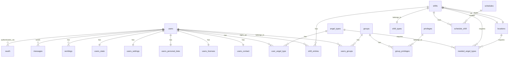

# Database

Engelsystem uses MySQL/MariaDB with Eloquent ORM for database access. This page documents the schema, models, and migration system.

## Schema Overview

The database contains 40+ tables organized around core entities. The central entity is the `users` table, with related tables for profile data, permissions, and activity.



## Key Tables

### User Tables

| Table | Purpose |
|-------|---------|
| `users` | User accounts (name, email, password hash, API key) |
| `users_contact` | Contact information (DECT number, mobile phone, email visibility) |
| `users_personal_data` | Personal info (first/last name, pronoun, shirt size, planned dates) |
| `users_state` | User state flags (arrived, active, got_shirt, force_active) |
| `users_settings` | Preferences (language, theme, email notification settings) |
| `users_licenses` | Driver licenses (car, truck, forklift capabilities) |

### Permission Tables

| Table | Purpose |
|-------|---------|
| `groups` | Permission groups (Angel, Supporter, Bureaucrat, etc.) |
| `privileges` | Individual permissions (user.edit, shifts.edit, etc.) |
| `group_privileges` | Links groups to privileges |
| `users_groups` | Links users to groups |

### Shift Tables

| Table | Purpose |
|-------|---------|
| `shifts` | Scheduled work shifts (title, start/end times, location) |
| `shift_types` | Categories of shifts (with descriptions) |
| `shift_entries` | User signups for shifts (with freeload marks) |
| `needed_angel_types` | Required angel counts per shift/location/type |

### Angel Type Tables

| Table | Purpose |
|-------|---------|
| `angel_types` | Types of volunteer work (with requirements) |
| `user_angel_type` | User qualifications and supporter status |

### Location Tables

| Table | Purpose |
|-------|---------|
| `locations` | Physical locations (name, description, map URL) |

### Schedule Import Tables

| Table | Purpose |
|-------|---------|
| `schedules` | External schedule sources (Frab/Pretalx URLs) |
| `schedule_shift` | Links imported shifts to their source schedules |

### Communication Tables

| Table | Purpose |
|-------|---------|
| `news` | Announcements and news posts |
| `news_comments` | Comments on news items |
| `messages` | Internal user-to-user messages |
| `questions` | Q&A system questions and answers |

### Other Tables

| Table | Purpose |
|-------|---------|
| `worklogs` | Manual work hour entries |
| `log_entries` | Audit log for admin actions |
| `sessions` | User session storage |
| `oauth` | OAuth provider links for external authentication |
| `faq` | FAQ entries |

## Eloquent Models

### Base Model

All models extend `BaseModel` which provides common configuration:

```php
namespace Engelsystem\Models;

abstract class BaseModel extends Model
{
    protected $connection = 'default';
    public $timestamps = false;
}
```

Key points:
- Connection name is always `default`
- Timestamps are disabled by default (some models override this)
- Models use Eloquent's full feature set (relationships, scopes, accessors)

### User Model

The `User` model (`src/Models/User/User.php`) is the most complex model:

```php
class User extends BaseModel
{
    protected $fillable = ['name', 'password', 'email', 'api_key', 'last_login_at'];
    protected $hidden = ['api_key', 'password'];

    // One-to-one relationships
    public function contact(): HasOne;
    public function personalData(): HasOne;
    public function settings(): HasOne;
    public function state(): HasOne;
    public function license(): HasOne;

    // Many-to-many relationships
    public function groups(): BelongsToMany;
    public function userAngelTypes(): BelongsToMany;

    // One-to-many relationships
    public function shiftEntries(): HasMany;
    public function worklogs(): HasMany;
    public function news(): HasMany;

    // Business logic
    public function isFreeloader(): bool;
    public function isAngelTypeSupporter(AngelType $angelType): bool;
}
```

### Shift Model

The `Shift` model (`src/Models/Shifts/Shift.php`) handles scheduled work:

```php
class Shift extends BaseModel
{
    protected $fillable = [
        'title', 'description', 'url', 'start', 'end',
        'shift_type_id', 'location_id', 'transaction_id',
        'created_by', 'updated_by'
    ];

    // Relationships
    public function shiftType(): BelongsTo;
    public function location(): BelongsTo;
    public function shiftEntries(): HasMany;
    public function neededAngelTypes(): HasMany;
    public function schedule(): HasOneThrough;

    // Business logic
    public function isNightShift(): bool;
    public function getNightShiftMultiplier(): float;
    public function nextShift(): ?Shift;
    public function previousShift(): ?Shift;
}
```

### Model Locations

Models are organized by domain in `src/Models/`:

```
src/Models/
├── AngelType.php
├── BaseModel.php
├── EventConfig.php
├── Faq.php
├── Group.php
├── Location.php
├── LogEntry.php
├── Message.php
├── News.php
├── NewsComment.php
├── OAuth.php
├── Privilege.php
├── Question.php
├── Session.php
├── Shifts/
│   ├── NeededAngelType.php
│   ├── Schedule.php
│   ├── ScheduleShift.php
│   ├── Shift.php
│   ├── ShiftEntry.php
│   └── ShiftType.php
├── User/
│   ├── Contact.php
│   ├── HasUserModel.php
│   ├── License.php
│   ├── PersonalData.php
│   ├── Settings.php
│   ├── State.php
│   └── User.php
├── UserAngelType.php
└── Worklog.php
```

## Migrations

Database migrations live in `db/migrations/` and are numbered chronologically. There are 110+ migration files covering the complete schema history.

### Running Migrations

```bash
# Run all pending migrations
./bin/migrate

# With Nix
nix run .#migrate
```

### Migration Structure

Migrations use Illuminate Database's migration system:

```php
<?php

declare(strict_types=1);

namespace Engelsystem\Migrations;

use Illuminate\Database\Schema\Blueprint;
use Engelsystem\Database\Migration\Migration;

class CreateExampleTable extends Migration
{
    public function up(): void
    {
        $this->schema->create('example', function (Blueprint $table) {
            $table->id();
            $table->string('name');
            $table->foreignId('user_id')->constrained();
            $table->timestamps();
        });
    }

    public function down(): void
    {
        $this->schema->dropIfExists('example');
    }
}
```

### Migration Naming

Files follow the pattern `YYYY_MM_DD_HHMMSS_description.php`:
- `2018_01_01_000001_import_install_sql.php` - Initial schema
- `2022_06_02_000000_create_privileges_and_groups.php` - Permission tables
- `2023_11_01_000000_add_shift_transaction_id.php` - Transaction support

### Key Migration Files

| Migration | Purpose |
|-----------|---------|
| `import_install_sql` | Initial schema from legacy SQL file |
| `create_privileges_and_groups` | Modern permission system |
| `create_locations_table` | Location management |
| `create_schedules_table` | Schedule import support |
| `add_oauth_support` | External authentication |

## Database Connection

Connection is configured in `config/config.php`:

```php
'database' => [
    'host' => env('MYSQL_HOST', 'localhost'),
    'database' => env('MYSQL_DATABASE', 'engelsystem'),
    'username' => env('MYSQL_USER', 'engelsystem'),
    'password' => env('MYSQL_PASSWORD', ''),
],
```

Or via environment variables:

| Variable | Description |
|----------|-------------|
| `MYSQL_HOST` | Database hostname |
| `MYSQL_DATABASE` | Database name |
| `MYSQL_USER` | Database username |
| `MYSQL_PASSWORD` | Database password |

## Query Patterns

### Using Models

```php
// Find user by name
$user = User::whereName('admin')->first();

// Get user's shifts with relationships
$shifts = $user->shiftEntries()
    ->with(['shift.location', 'shift.shiftType'])
    ->get();

// Query shifts at a location
$shifts = Shift::where('location_id', $locationId)
    ->where('start', '>=', Carbon::now())
    ->orderBy('start')
    ->get();
```

### Transactions

For complex operations, use database transactions:

```php
$db->getConnection()->transaction(function () {
    // Multiple related operations
    $shift->delete();
    $shiftEntries->each->delete();
});
```

## Factory System

Model factories for testing live in `db/factories/`:

```php
// db/factories/UserFactory.php
class UserFactory extends Factory
{
    protected $model = User::class;

    public function definition(): array
    {
        return [
            'name' => $this->faker->unique()->userName(),
            'password' => password_hash('password', PASSWORD_DEFAULT),
            'email' => $this->faker->unique()->email(),
            'api_key' => bin2hex(random_bytes(32)),
        ];
    }
}
```

Usage in tests:

```php
$user = User::factory()->create();
$users = User::factory()->count(10)->create();
```

