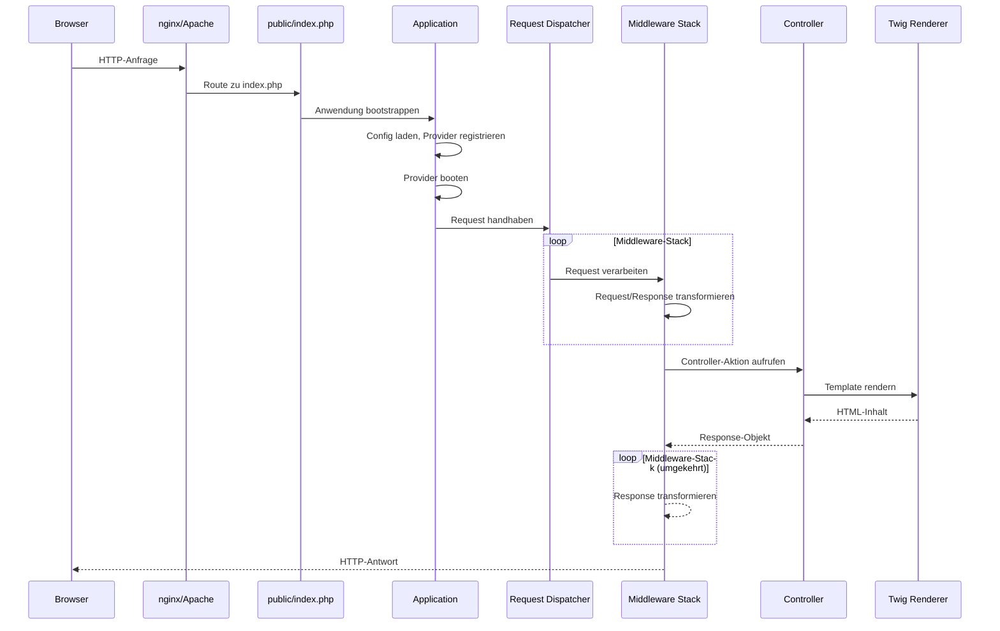
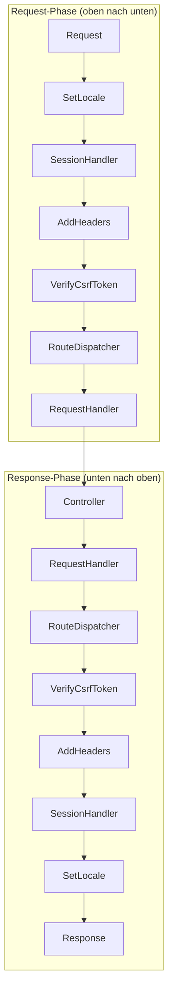

Das Verständnis, wie Engelsystem HTTP-Anfragen verarbeitet, hilft dir beim Debuggen von Problemen und beim Hinzufügen neuer Funktionalität. Diese Seite führt durch die komplette Reise einer Anfrage vom Webserver bis zur Antwort.

## Überblick



## Einstiegspunkt

Jede Anfrage tritt durch `public/index.php` ein. Diese Datei:

1. Inkludiert die Bootstrap-Datei (`includes/engelsystem.php`)
2. Die wiederum das Anwendungs-Setup inkludiert (`includes/application.php`)
3. Richtet Composer-Autoloading ein
4. Erstellt den Application-Container

```php
// public/index.php (vereinfacht)
require_once __DIR__ . '/../includes/engelsystem.php';

// Anwendung ist jetzt gebootstrapped und bereit
```

### Wartungsmodus

Vor der normalen Request-Verarbeitung prüft das Bootstrap auf Wartungsmodus:

```php
if ($app->get('config')->get('maintenance')) {
    // maintenance.html rendern und beenden
    echo file_get_contents('resources/views/layouts/maintenance.html');
    exit;
}
```

Dies ermöglicht es, die Anwendung offline zu nehmen, indem `'maintenance' => true` in der Konfiguration gesetzt wird.

## Anwendungs-Bootstrapping

Die Anwendung bootstrapped in zwei Phasen:

### 1. Service-Provider-Registrierung

Die `register()`-Methode jedes Providers wird aufgerufen, um Services an den Container zu binden:

```php
class DatabaseServiceProvider extends ServiceProvider
{
    public function register(): void
    {
        // Datenbankverbindung an Container binden
        $this->app->singleton(Connection::class, function ($app) {
            return new Connection($app->get('config')->get('database'));
        });
    }
}
```

**Wichtig**: Während der Registrierung nicht auf die Verfügbarkeit anderer Services verlassen. Nur eigene Services binden.

### 2. Service-Provider-Boot

Nachdem alle Provider registriert sind, wird jede `boot()`-Methode aufgerufen:

```php
class AuthServiceProvider extends ServiceProvider
{
    public function boot(): void
    {
        // Jetzt sind andere Services verfügbar
        $auth = $this->app->get(Authenticator::class);
        $auth->setSessionHandler($this->app->get(Session::class));
    }
}
```

**Wichtig**: `boot()` für Konfiguration verwenden, die von anderen Services abhängt.

### Provider-Kategorien

Service-Provider fallen in drei Kategorien:

| Kategorie | Beispiele | Zweck |
|-----------|-----------|-------|
| Core | ConfigServiceProvider, LogServiceProvider | Basis-Infrastruktur |
| Request | SessionServiceProvider, AuthServiceProvider | HTTP-Handling |
| Services | MailServiceProvider, TranslationServiceProvider | Anwendungs-Features |

Die Provider-Reihenfolge ist in `config/app.php` definiert.

## Request-Dispatching

Nach dem Bootstrapping wird der Request an den PSR-15-konformen Dispatcher übergeben:

```php
$dispatcher = $app->get(Dispatcher::class);
$response = $dispatcher->handle($request);
```

Der Dispatcher führt den Request durch eine Middleware-Pipeline, die in `config/app.php` definiert ist.

## Middleware-Stack

Middlewares verarbeiten Requests in Reihenfolge, dann Responses in umgekehrter Reihenfolge:



### Core-Middleware

| Middleware | Zweck |
|------------|-------|
| `SetLocale` | Setzt Sprache basierend auf Benutzerpräferenz oder Browser |
| `SessionHandler` | Initialisiert Session, lädt Benutzer |
| `AddHeaders` | Fügt Security-Header hinzu (CSP, X-Frame-Options usw.) |
| `VerifyCsrfToken` | Validiert CSRF-Token bei POST-Requests |
| `RouteDispatcher` | Matched URL zu Route in `config/routes.php` |
| `RequestHandler` | Ruft Controller auf und prüft Berechtigungen |
| `LegacyMiddleware` | Handhabt alte Seiten in `includes/` |

### Middleware-Interface

Alle Middleware implementiert PSR-15's `MiddlewareInterface`:

```php
class ExampleMiddleware implements MiddlewareInterface
{
    public function process(
        ServerRequestInterface $request,
        RequestHandlerInterface $handler
    ): ResponseInterface {
        // Vorher: Request modifizieren
        $request = $request->withAttribute('example', 'value');

        // An nächste Middleware/Controller weitergeben
        $response = $handler->handle($request);

        // Nachher: Response modifizieren
        return $response->withHeader('X-Example', 'value');
    }
}
```

### Eigene Middleware hinzufügen

1. Erstelle deine Middleware-Klasse in `src/Middleware/`
2. Registriere sie in `config/app.php` unter dem `middleware`-Schlüssel
3. Reihenfolge ist wichtig: platziere sie angemessen im Stack

## Routing

Die `RouteDispatcher`-Middleware matched Requests gegen Routen, die in `config/routes.php` definiert sind:

```php
// config/routes.php
return [
    '/shifts'       => 'ShiftController@index',
    '/shifts/{id}' => 'ShiftController@show',
    '/login'       => 'AuthController@login',
    '/logout'      => 'AuthController@logout',
];
```

Route-Parameter (wie `{id}`) werden extrahiert und an Controller übergeben.

### Route-Matching

Routen werden in Reihenfolge gematched. Der erste Treffer gewinnt:

```php
// Spezifischere Routen zuerst
'/shifts/create' => 'ShiftController@create',  // Matched /shifts/create
'/shifts/{id}'   => 'ShiftController@show',    // Matched /shifts/123
'/shifts'        => 'ShiftController@index',   // Matched /shifts
```

### Legacy-Routen

Wenn keine Route matched, prüft `LegacyMiddleware` auf alte Seiten in `includes/pages/`:

```php
// Request zu /admin_shifts lädt includes/pages/admin_shifts.php
```

Neue Features sollten Controller verwenden, nicht Legacy-Seiten.

## Request-Handler

Die `RequestHandler`-Middleware:

1. Löst die Controller-Klasse aus dem Container auf
2. Prüft Berechtigungsanforderungen (falls definiert)
3. Ruft die Controller-Methode auf
4. Gibt die Response zurück

### Berechtigungsprüfung

Controller können Berechtigungen via Attribute erfordern:

```php
#[RequirePermission('shifts.edit')]
class ShiftAdminController extends BaseController
{
    public function create(): Response
    {
        // Nur Benutzer mit shifts.edit-Berechtigung kommen hierher
    }
}
```

Benutzer ohne die erforderliche Berechtigung sehen einen Zugriff-verweigert-Fehler.

## Controller

Controller verarbeiten Requests und geben Responses zurück:

```php
class ShiftController extends BaseController
{
    public function __construct(
        protected Response $response,
        protected ShiftRepository $shifts
    ) {
    }

    public function index(): Response
    {
        $shifts = $this->shifts->upcoming();

        return $this->response->withView('shifts/index', [
            'shifts' => $shifts,
        ]);
    }

    public function show(Request $request): Response
    {
        $id = $request->getAttribute('id');
        $shift = $this->shifts->find($id);

        if (!$shift) {
            throw new HttpNotFound();
        }

        return $this->response->withView('shifts/show', [
            'shift' => $shift,
        ]);
    }
}
```

### Response-Typen

Controller können verschiedene Response-Typen zurückgeben:

```php
// HTML-View
return $this->response->withView('template', $data);

// JSON-Response
return $this->response->withJson(['status' => 'ok']);

// Redirect
return $this->response->redirectTo('/shifts');

// Download
return $this->response->withContent($content)
    ->withHeader('Content-Disposition', 'attachment; filename="export.csv"');
```

## View-Rendering

Twig-Templates in `resources/views/` rendern das HTML:

```twig
{# resources/views/shifts/index.twig #}



    <h1>{{ __('Verfügbare Schichten') }}</h1>

    
        <div class="shift">
            {{ shift.title }} - {{ shift.start|date('H:i') }}
        </div>
    

```

### Template-Helper

Gängige Helper, die in Templates verfügbar sind:

| Helper | Zweck |
|--------|-------|
| `__('text')` | Übersetzung |
| `url('/path')` | URL generieren |
| `config('key')` | Auf Konfiguration zugreifen |
| `auth()->user()` | Aktueller Benutzer |

## Events

Einige Operationen lösen Events für entkoppelte Handhabung aus:

```php
// Event auslösen
$this->dispatcher->dispatch('shift.signup', new ShiftSignupEvent($shift, $user));

// Events lauschen (in einem Provider)
$events->listen('shift.signup', function (ShiftSignupEvent $event) {
    // Benachrichtigungs-E-Mail senden
});
```

Event-Listener werden in `config/app.php` unter `event-listeners` konfiguriert.

### Gängige Events

| Event | Ausgelöst wenn |
|-------|----------------|
| `shift.signup` | Benutzer meldet sich für Schicht an |
| `shift.cancel` | Benutzer sagt Schichtanmeldung ab |
| `message.sent` | Benutzer sendet eine Nachricht |
| `user.created` | Neuer Benutzer registriert sich |

## Requests debuggen

### Debug-Modus aktivieren

Setze `'environment' => 'development'` in der Konfiguration, um detaillierte Fehler zu sehen.

### Logs prüfen

Anwendungs-Logs sind in `storage/logs/`:

```bash
tail -f storage/logs/engelsystem.log
```

### Variablen ausgeben

In der Entwicklung `dd()` (dump and die) oder `dump()` verwenden:

```php
public function index(): Response
{
    $shifts = $this->shifts->all();
    dd($shifts);  // Gibt Variable aus und stoppt Ausführung
}
```

### Datenbank-Queries

Query-Logging aktivieren um SQL zu sehen:

```php
DB::connection()->enableQueryLog();
// ... dein Code ...
dd(DB::getQueryLog());
```

### Häufige Probleme

**404 Not Found**
- Prüfe ob Route in `config/routes.php` existiert
- Verifiziere dass URL-Pattern matched
- Prüfe auf Tippfehler im Controller-Namen

**403 Forbidden**
- Benutzer hat erforderliche Berechtigung nicht
- Prüfe `#[RequirePermission]`-Attribut
- Verifiziere dass Benutzergruppe das Privileg hat

**500 Server Error**
- Prüfe `storage/logs/` für Stack-Trace
- Aktiviere Entwicklungsmodus für Details
- Verifiziere Datenbankverbindung

**CSRF Token Mismatch**
- Formular fehlt `{{ csrf() }}`-Helper
- Session abgelaufen
- Prüfe Session-Konfiguration

## Neue Routen hinzufügen

1. **Route definieren** in `config/routes.php`:
   ```php
   '/my-feature' => 'MyFeatureController@index',
   ```

2. **Controller erstellen** in `src/Controllers/`:
   ```php
   class MyFeatureController extends BaseController
   {
       public function index(): Response
       {
           return $this->response->withView('my-feature/index');
       }
   }
   ```

3. **Template erstellen** in `resources/views/my-feature/index.twig`

4. **Berechtigungen registrieren** falls nötig in Migrationen oder Seedern
