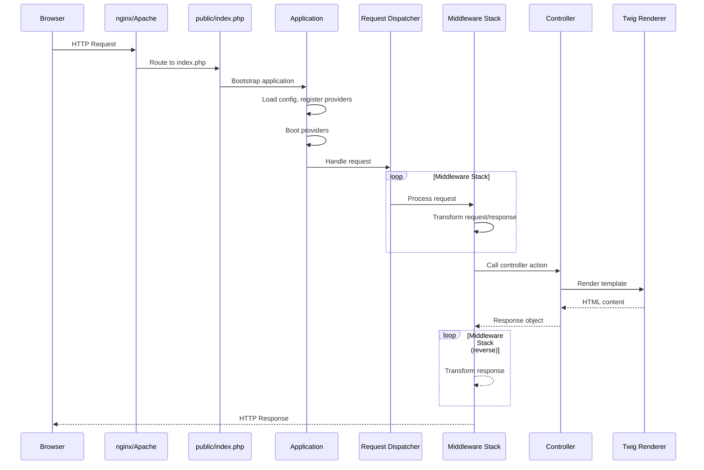
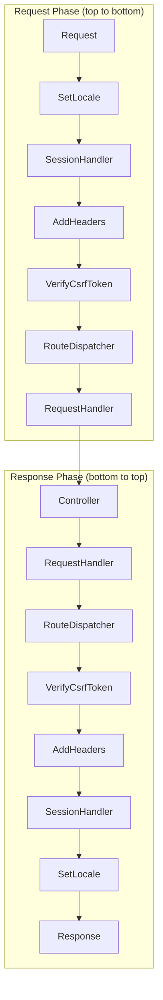

Understanding how Engelsystem processes HTTP requests helps you debug issues and add new functionality. This page walks through the complete journey of a request from web server to response.

## Overview



## Entry Point

Every request enters through `public/index.php`. This file:

1. Includes the bootstrap file (`includes/engelsystem.php`)
2. Which includes application setup (`includes/application.php`)
3. Sets up Composer autoloading
4. Creates the Application container

```php
// public/index.php (simplified)
require_once __DIR__ . '/../includes/engelsystem.php';

// Application is now bootstrapped and ready
```

### Maintenance Mode

Before normal request processing, the bootstrap checks for maintenance mode:

```php
if ($app->get('config')->get('maintenance')) {
    // Render maintenance.html and exit
    echo file_get_contents('resources/views/layouts/maintenance.html');
    exit;
}
```

This allows you to take the application offline by setting `'maintenance' => true` in configuration.

## Application Bootstrapping

The application bootstraps in two phases:

### 1. Service Provider Registration

Each provider's `register()` method is called to bind services to the container:

```php
class DatabaseServiceProvider extends ServiceProvider
{
    public function register(): void
    {
        // Bind database connection to container
        $this->app->singleton(Connection::class, function ($app) {
            return new Connection($app->get('config')->get('database'));
        });
    }
}
```

**Important**: During registration, don't rely on other services being available. Only bind your own services.

### 2. Service Provider Boot

After all providers register, each `boot()` method is called:

```php
class AuthServiceProvider extends ServiceProvider
{
    public function boot(): void
    {
        // Now other services are available
        $auth = $this->app->get(Authenticator::class);
        $auth->setSessionHandler($this->app->get(Session::class));
    }
}
```

**Important**: Use `boot()` for configuration that depends on other services.

### Provider Categories

Service providers fall into three categories:

| Category | Examples | Purpose |
|----------|----------|---------|
| Core | ConfigServiceProvider, LogServiceProvider | Basic infrastructure |
| Request | SessionServiceProvider, AuthServiceProvider | HTTP handling |
| Services | MailServiceProvider, TranslationServiceProvider | Application features |

The provider order is defined in `config/app.php`.

## Request Dispatching

After bootstrapping, the request is handed to the PSR-15 compliant dispatcher:

```php
$dispatcher = $app->get(Dispatcher::class);
$response = $dispatcher->handle($request);
```

The dispatcher runs the request through a middleware pipeline defined in `config/app.php`.

## Middleware Stack

Middlewares process requests in order, then responses in reverse order:



### Core Middleware

| Middleware | Purpose |
|------------|---------|
| `SetLocale` | Sets language based on user preference or browser |
| `SessionHandler` | Initializes session, loads user |
| `AddHeaders` | Adds security headers (CSP, X-Frame-Options, etc.) |
| `VerifyCsrfToken` | Validates CSRF token on POST requests |
| `RouteDispatcher` | Matches URL to route in `config/routes.php` |
| `RequestHandler` | Invokes controller and checks permissions |
| `LegacyMiddleware` | Handles old-style pages in `includes/` |

### Middleware Interface

All middleware implements PSR-15's `MiddlewareInterface`:

```php
class ExampleMiddleware implements MiddlewareInterface
{
    public function process(
        ServerRequestInterface $request,
        RequestHandlerInterface $handler
    ): ResponseInterface {
        // Before: Modify request
        $request = $request->withAttribute('example', 'value');

        // Pass to next middleware/controller
        $response = $handler->handle($request);

        // After: Modify response
        return $response->withHeader('X-Example', 'value');
    }
}
```

### Adding Custom Middleware

1. Create your middleware class in `src/Middleware/`
2. Register it in `config/app.php` under the `middleware` key
3. Order matters: place it appropriately in the stack

## Routing

The `RouteDispatcher` middleware matches requests against routes defined in `config/routes.php`:

```php
// config/routes.php
return [
    '/shifts'       => 'ShiftController@index',
    '/shifts/{id}' => 'ShiftController@show',
    '/login'       => 'AuthController@login',
    '/logout'      => 'AuthController@logout',
];
```

Route parameters (like `{id}`) are extracted and passed to controllers.

### Route Matching

Routes are matched in order. The first match wins:

```php
// More specific routes first
'/shifts/create' => 'ShiftController@create',  // Matches /shifts/create
'/shifts/{id}'   => 'ShiftController@show',    // Matches /shifts/123
'/shifts'        => 'ShiftController@index',   // Matches /shifts
```

### Legacy Routes

If no route matches, `LegacyMiddleware` checks for old-style pages in `includes/pages/`:

```php
// Request to /admin_shifts loads includes/pages/admin_shifts.php
```

New features should use controllers, not legacy pages.

## Request Handler

The `RequestHandler` middleware:

1. Resolves the controller class from the container
2. Checks permission requirements (if defined)
3. Calls the controller method
4. Returns the response

### Permission Checking

Controllers can require permissions via attributes:

```php
#[RequirePermission('shifts.edit')]
class ShiftAdminController extends BaseController
{
    public function create(): Response
    {
        // Only users with shifts.edit permission reach here
    }
}
```

Users without the required permission see an access denied error.

## Controllers

Controllers process requests and return responses:

```php
class ShiftController extends BaseController
{
    public function __construct(
        protected Response $response,
        protected ShiftRepository $shifts
    ) {
    }

    public function index(): Response
    {
        $shifts = $this->shifts->upcoming();

        return $this->response->withView('shifts/index', [
            'shifts' => $shifts,
        ]);
    }

    public function show(Request $request): Response
    {
        $id = $request->getAttribute('id');
        $shift = $this->shifts->find($id);

        if (!$shift) {
            throw new HttpNotFound();
        }

        return $this->response->withView('shifts/show', [
            'shift' => $shift,
        ]);
    }
}
```

### Response Types

Controllers can return different response types:

```php
// HTML view
return $this->response->withView('template', $data);

// JSON response
return $this->response->withJson(['status' => 'ok']);

// Redirect
return $this->response->redirectTo('/shifts');

// Download
return $this->response->withContent($content)
    ->withHeader('Content-Disposition', 'attachment; filename="export.csv"');
```

## View Rendering

Twig templates in `resources/views/` render the HTML:

```twig
{# resources/views/shifts/index.twig #}



    <h1>{{ __('Available Shifts') }}</h1>

    
        <div class="shift">
            {{ shift.title }} - {{ shift.start|date('H:i') }}
        </div>
    

```

### Template Helpers

Common helpers available in templates:

| Helper | Purpose |
|--------|---------|
| `__('text')` | Translation |
| `url('/path')` | Generate URL |
| `config('key')` | Access configuration |
| `auth()->user()` | Current user |

## Events

Some operations trigger events for decoupled handling:

```php
// Firing an event
$this->dispatcher->dispatch('shift.signup', new ShiftSignupEvent($shift, $user));

// Listening to events (in a provider)
$events->listen('shift.signup', function (ShiftSignupEvent $event) {
    // Send notification email
});
```

Event listeners are configured in `config/app.php` under `event-listeners`.

### Common Events

| Event | Triggered When |
|-------|----------------|
| `shift.signup` | User signs up for a shift |
| `shift.cancel` | User cancels a shift signup |
| `message.sent` | User sends a message |
| `user.created` | New user registers |

## Debugging Requests

### Enable Debug Mode

Set `'environment' => 'development'` in configuration to see detailed errors.

### Check Logs

Application logs are in `storage/logs/`:

```bash
tail -f storage/logs/engelsystem.log
```

### Dump Variables

In development, use `dd()` (dump and die) or `dump()`:

```php
public function index(): Response
{
    $shifts = $this->shifts->all();
    dd($shifts);  // Dumps variable and stops execution
}
```

### Database Queries

Enable query logging to see SQL:

```php
DB::connection()->enableQueryLog();
// ... your code ...
dd(DB::getQueryLog());
```

### Common Issues

**404 Not Found**
- Check route exists in `config/routes.php`
- Verify URL pattern matches
- Check for typos in controller name

**403 Forbidden**
- User lacks required permission
- Check `#[RequirePermission]` attribute
- Verify user's group has the privilege

**500 Server Error**
- Check `storage/logs/` for stack trace
- Enable development mode for details
- Verify database connection

**CSRF Token Mismatch**
- Form missing `{{ csrf() }}` helper
- Session expired
- Check session configuration

## Adding New Routes

1. **Define the route** in `config/routes.php`:
   ```php
   '/my-feature' => 'MyFeatureController@index',
   ```

2. **Create the controller** in `src/Controllers/`:
   ```php
   class MyFeatureController extends BaseController
   {
       public function index(): Response
       {
           return $this->response->withView('my-feature/index');
       }
   }
   ```

3. **Create the template** in `resources/views/my-feature/index.twig`

4. **Register permissions** if needed in migrations or seeders
